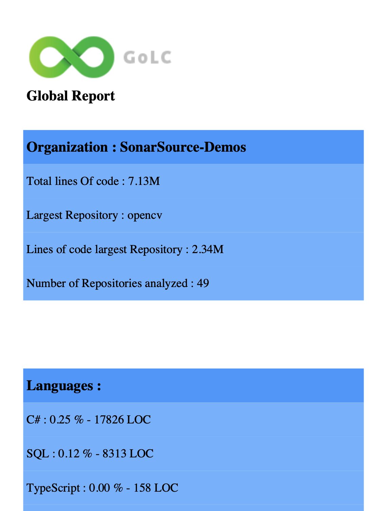
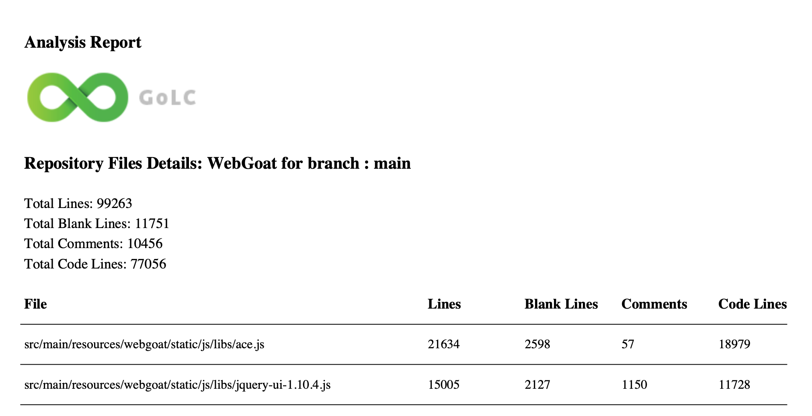

[](https://nautilus.sonarqube.org/dashboard?id=SonarSource-Demos_sonar-golc)[](https://nautilus.sonarqube.org/dashboard?id=SonarSource-Demos_sonar-golc)[](https://nautilus.sonarqube.org/dashboard?id=SonarSource-Demos_sonar-golc)[](https://nautilus.sonarqube.org/dashboard?id=SonarSource-Demos_sonar-golc)


## Introduction


**GoLC** is a clever abbreviation for "Go Line Counter," drawing inspiration from [CLOC](https://github.com/AlDanial/cloc "AlDanial") and various other line-counting tools in Go like [GCloc](https://github.com/JoaoDanielRufino/gcloc "João Daniel Rufino").

**GoLC** counts physical lines of source code in numerous programming languages supported by the Developer, Enterprise, and Data Center editions of [SonarQube](https://www.sonarsource.com/knowledge/languages/) across your Bitbucket Cloud, Bitbucket Data Center (on-premises), GitHub.com (Cloud), GitHub Enterprise Server (on-premises), GitLab.com (Cloud), GitLab Self-Managed (on-premises), and Azure DevOps Services (Cloud) repositories.
GoLC can be used to estimate LoC counts that would be produced by a Sonar analysis of these projects, without having to implement this analysis.

GoLC The tool analyzes your repositories and identifies the largest branch of each repository, counting the total number of lines of code per language for that branch. At the end of the analysis, a text and PDF report is generated, along with a JSON results file for each repository.It starts an HTTP service to display an HTML page with the results.

> This last version is ver1.0.9 is available for Bitbucket Cloud, Bitbucket Data Center (on-premises), GitHub.com (Cloud), GitHub Enterprise Server (on-premises), GitLab.com (Cloud), GitLab Self-Managed (on-premises), and Azure DevOps Services (Cloud) repositories and Files.


---
## Installation

You can install from the stable release by clicking [here](https://github.com/SonarSource-Demos/sonar-golc/releases/tag/V1.0.9)


## Prerequisites 

* A personal access tokens for : Bitbucket Cloud,Bitbucket DC, GitHub, GitLab and Azure DevOps. The token must have:
     - repo scope.
     - Perform pull request actions
     - Push, pull and clone repositories
     - For example, for GitLab, the permissions needed are: read_repository, read_api
  
* [Go language installed](https://go.dev/) : If you want to use the sources...


## Supported languages

To show all supported languages use the subcommand languages :

 ```
$:> golc.go -languages

Language           | Extensions                               | Single Comments | Multi Line
                    |                                          |                 | Comments
-------------------+------------------------------------------+-----------------+--------------
Abap               | .abap, .ab4, .flow, .asprog              | *, "            | 
ActionScript       | .as                                      | //              | /* */ 
Apex               | .cls, .trigger                           | //              | /* */ 
C                  | .c                                       | //              | /* */ 
C Header           | .h                                       | //              | /* */ 
C++                | .cpp, .cc                                | //              | /* */ 
C++ Header         | .hh, .hpp                                | //              | /* */ 
C#                 | .cs                                      | //              | /* */ 
COBOL              | .cbl, .ccp, .cob, .cobol, .cpy           | *               | 
CSS                | .css                                     |                 | /* */ 
Dart               | .dart                                    | //              | /* */ 
Docker             | Dockerfile, dockerfile                   | #               | 
Flex               | .as                                      | //              | /* */ 
Golang             | .go                                      | //              | /* */ 
HTML               | .html, .htm, .cshtml, .vbhtml, .aspx,    |                 | <!-- --> 
                    | .ascx, .rhtml, .erb, .shtml, .shtm, cmp  |                 | <!-- -->
Java               | .java, .jav                              | //              | /* */ 
JavaScript         | .js, .jsx, .jsp, .jspf                   | //              | /* */ 
JCL                | .jcl, .JCL                               | //*             | 
JSON               | .json                                    |                 | 
Kotlin             | .kt, .kts                                | //              | /* */ 
Objective-C        | .m, .mm                                  | //              | /* */ 
Oracle PL/SQL      | .pkb                                     | --              | /* */ 
PHP                | .php, .php3, .php4, .php5, .phtml, .inc  | //, #           | /* */ 
PL/I               | .pl1                                     |                 | /* */ 
Python             | .py                                      | #               | """ """, ''' ''' 
RPG                | .rpg                                     | *               | 
Ruby               | .rb                                      | #               | =begin =end 
Rust               | .rs                                      | //              | /* */ 
Scala              | .scala                                   | //              | /* */ 
Scss               | .scss                                    | //              | /* */ 
Shell              | .sh, .bash, .zsh, .ksh                   | #               | 
SQL                | .sql                                     | --              | /* */ 
Swift              | .swift                                   | //              | /* */ 
Terraform          | .tf                                      | #, //           | /* */ 
T-SQL              | .tsql                                    | --              | /* */ 
TypeScript         | .ts, .tsx                                | //              | /* */ 
VB6                | .bas, .frm, .cls                         | '               | 
Visual Basic .NET  | .vb                                      | '               | 
Vue                | .vue                                     |                 | <!-- --> 
XML                | .xml, .XML                               |                 | <!-- --> 
XHTML              | .xhtml                                   |                 | <!-- --> 
YAML               | .yaml, .yml                              | #               | 

 ```

 ❗️ To add a new language, you need to add an entry to the Languages structure defined in the file [assets/languages.go](assets/languages.go).


 ## Usage

 ✅ Environment Configuration

 Before running GoLC, you need to configure your environment by initializing the various values in the config.json file.
 Copy the **config_sample.json** file to **config.json** and modify the various entries.

 ```json
{
    "platforms": {
      "BitBucketSRV": {
        "Users": "XXXXX",
        "AccessToken": "XXXXX",
        "Organization": "XXXXX",
        "DevOps": "bitbucket_dc",
        "Project": "",
        "Repos": "",
        "Branch": "",
        "DefaultBranch": true,
        "Url": "http://ec2-18-194-139-24.eu-central-1.compute.amazonaws.com:7990/",
        "Apiver": "1.0",
        "Baseapi": "rest/api/",
        "Protocol": "http",
        "FileExclusion":".cloc_bitbucketdc_ignore",
        "ExtExclusion":[],
        "ExcludePaths":[],
        "Period":-5,
        "Factor":33,
        "Multithreading":true,
        "Stats": false,
        "Workers": 10,
        "NumberWorkerRepos":10,
        "ResultByFile": false,
        "ResultAll": true,
        "Org":true
      },
      "BitBucket": {
        "Users": "XXXXX",
        "AccessToken": "XXXXX",
        "Organization": "XXXXX",
        "DevOps": "bitbucket",
        "Workspace":"XXXXX",
        "Project":"",
        "Repos": "",
        "Branch": "",
        "DefaultBranch": true,
        "Url": "https://api.bitbucket.org/",
        "Apiver": "2.0",
        "Baseapi": "bitbucket.org",
        "Protocol": "https",
        "FileExclusion":".cloc_bitbucket_ignore",
        "ExtExclusion":[],
        "ExcludePaths":[],
        "Period":-1,
        "Factor":33,
        "Multithreading":true,
        "Stats": false,
        "Workers": 10,
        "NumberWorkerRepos":10,
        "ResultByFile": false,
        "ResultAll": true,
        "Org":true
      },
      
      "Github": {
        "Users": "XXXXX",
        "AccessToken": "XXXXX", 
        "Organization": "XXXXX",
        "DevOps": "github",
        "Project": "",
        "Repos": "",
        "Branch": "",
        "DefaultBranch": true,
        "Url": "https://api.github.com/",
        "Apiver": "2022-11-28",
        "Baseapi": "github.com",
        "Protocol": "https",
        "FileExclusion":".cloc_github_ignore",
        "ExtExclusion":[],
        "ExcludePaths":[],
        "Period":-1,
        "Factor":33,
        "Multithreading":true,
        "Stats": false,
        "Workers": 10 ,
        "NumberWorkerRepos":10,
        "ResultByFile": false,
        "ResultAll": true,
        "Org":true
      },
      "GithubEnterprise": {
        "Users": "XXXXX",
        "AccessToken": "XXXXX", 
        "Organization": "XXXXX",
        "DevOps": "github",
        "Project": "",
        "Repos": "",
        "Branch": "",
        "DefaultBranch": true,
        "Url": "https://github-enterprise.yourcompany.com/",
        "Apiver": "2022-11-28",
        "Baseapi": "github-enterprise.yourcompany.com",
        "Protocol": "https",
        "FileExclusion":".cloc_github_ignore",
        "ExtExclusion":[],
        "ExcludePaths":[],
        "Period":-1,
        "Factor":33,
        "Multithreading":true,
        "Stats": false,
        "Workers": 10 ,
        "NumberWorkerRepos":10,
        "ResultByFile": false,
        "ResultAll": true,
        "Org":true
      },

      "Gitlab": {
        "Users": "XXXXX",
        "AccessToken": "XXXXX",
        "Organization":"XXXXX",
        "DevOps": "gitlab",
        "Project": "",
        "Repos": "",
        "Branch": "",
        "DefaultBranch": true,
        "Url": "https://gitlab.com/",
        "Apiver": "v4",
        "Baseapi": "api/",
        "Protocol": "https",
        "FileExclusion":".cloc_gitlab_ignore",
        "ExtExclusion":[],
        "ExcludePaths":[],
        "Period":-1,
        "Factor":33,
        "Multithreading":true,
        "Stats": false,
        "Workers": 10,
        "NumberWorkerRepos":10,
        "ResultByFile": false,
        "ResultAll": true,
        "Org":true
      },
      "Azure": {
        "Users": "XXXXX",
        "AccessToken": "XXXXX",
        "Organization": "XXXXX",
        "DevOps": "azure",
        "Project": "",
        "Repos": "",
        "Branch": "",
        "DefaultBranch": true,
        "Url": "https://dev.azure.com/",
        "Apiver": "7.1",
        "Baseapi": "_apis/git/",
        "Protocol": "https",
        "FileExclusion":".cloc_azure_ignore",
        "ExtExclusion":[],
        "ExcludePaths":[],
        "Period":-1,
        "Factor":33,
        "Multithreading":true,
        "Stats": false,
        "Workers": 10,
        "NumberWorkerRepos":10,
        "ResultByFile": false,
        "ResultAll": true,
        "Org":true
      },
      "File": {
        "Organization": "XXXXX",
        "DevOps": "file",
        "Directory":"../gcloc_m/.",
        "FileExclusion":".cloc_file_ignore",
        "ExtExclusion":[""],
        "FileLoad":".cloc_file_load",
        "ResultByFile": false,
        "ResultAll": true

      }
    },
    "Logging": {
      "Level": "debug"
    },
    "Release":  {
      "Version": "1.0.9"
    }
  }
    
 ```
This file represents the 6 supported platforms for analysis: Bitbucket Cloud, Bitbucket Data Center (on-premises), GitHub.com (Cloud), GitHub Enterprise Server (on-premises), GitLab.com (Cloud), GitLab Self-Managed (on-premises), and Azure DevOps Services (Cloud) repositories, and File. Depending on your platform, for example, Bitbucket DC (enter BitBucketSRV), specify the parameters:

 ```json
"Users": "xxxxxxxxxxxxxx" : Your User login
"AccessToken": "xxxxxxxxxxxxxx" : Your Token
"Organization": "xxxxxx": Your organization
 ```

Notes for GitLab:
- You can specify multiple groups by providing a comma-separated list in `Organization`, e.g., `"Organization": "group1,group2"`. A single group works as `"Organization": "group1"`.

If '**Projects**' and '**Repos**' are not specified, the analysis will be conducted on all repositories. You can specify a project name (PROJECT_KEY) in '**Projects**', and the analysis will be limited to the specified project. If you specify '**Repos**' (REPO_SLUG), the analysis will be limited to the specified repositories.
```json
"Project": "",
"Repos": "",
```
❗️ The '**Projects**' entry is supported exclusively on the BitBucket and AzureDevops platform.

**Bitbucket DC Configuration:**

For Bitbucket DC, you must provide the URL with your server address and change the '**Protocol**' entry if you are using an https connection , ending with '**/**'. The '**Branch**' input allows you to select a specific branch for all repositories within an organization or project, or for a single repository. For example, if you only want all branches to be "main", '**"Branch":"main"**' .
```json
 "Url": "http://X.X.X.X/"
 ```
You can create a **.cloc_'your_platform'_ignore** file to ignore projects or repositories in the analysis. 
```json
   "FileExclusion":".cloc_bitbucketdc_ignore"
```
The syntax of this file is as follows for BitBucket:

```
REPO_SLUG
PROJECT_KEY 
PROJECT_KEY/REPO_SLUG
```

```
- REPO_SLUG = for one Repository
- PROJECT_KEY = for one Project
- PROJECT_KEY/REPO_SLUG For un Repository in one Project
```

The syntax of this file is as follows for GitHub:

```
REPO1_SLUG
REPO2_SLUG
...
```

```
- REPO1_SLUG = for one Repository
```

**GitHub Enterprise Server Configuration:**

For GitHub Enterprise Server (on-premises), modify the URL configuration:

```json
"GithubEnterprise": {
  "Url": "https://github.yourcompany.com/",
  "Baseapi": "github.yourcompany.com",
  "Protocol": "https"
}
```

- **Url**: Your GitHub Enterprise Server URL (e.g., `https://github.yourcompany.com/`)
- **Baseapi**: Your GitHub Enterprise Server hostname (e.g., `github.yourcompany.com`)

**GitLab Enterprise Server Configuration:**

For GitLab Self-Managed (on-premises), modify the URL configuration

```json
"Gitlab": {
  "Url": "https://gitlab.yourcompany.com/",
  "Protocol": "https"
}
```

- **Url**: Your GitLab Self-Managed Server URL (e.g., `https://gitlab.yourcompany.com/`)

**File Mode Configuration:**

The syntax of this file is as follows for File:

```
DIRECTORY_NAME
FILE_NAME
...
```

**Azure Devops Configuration:**

The syntax of this file is as follows for Azure Devops :

```
PROJECT_KEY/REPO_SLUG
PROJECT_KEY
```

 ✅  Config.json File Settings

❗️ For the **File** mode, if you want to have a list of directories to analyze, you create a **.cloc_file_load** file and add the directories to be analyzed line by line.If the **.cloc_file_load**. file is provided, its contents will override the **Directory** parameter."

❗️ The parameters **'Period'**, **'Factor'**, and **'Stats'** should not be modified as they will be used in a future version.

❗️ The parameters **'Multithreading'** and **'Workers'** initialize whether multithreading is enabled or not, allowing parallel analysis. You can disable it by setting **'Multithreading'** to **false**. **'Workers'** corresponds to the number of concurrent analyses.These parameters can be adjusted according to the performance of the compute running GoLC.

❗️ The boolean parameter **DefaultBranch**, if set to true, specifies that only the default branch of each repository should be analyzed. If set to false, it will analyze all branches of each repository to determine the most important one.

❗️ Exclude extensions.
If you want to exclude files by their extensions, use the parameter **'ExtExclusion'**. For example, if you want to exclude all CSS or JS files : 'ExtExclusion':[".css",".js"],

❗️ Results By File.
If you want results by file rather than globally by language, you need to set the **'ResultByFile'** parameter to true in the **config.json** file. In the **Results** directory, you will then have a JSON file for each analyzed repository containing a list of files with details such as the number of lines of code, comments, etc. Additionally, a PDF file named **complete_report.pdf** will be available in the **Results/reports** directory. To generate this report, you need to run the **ResultByfiles** program.

❗️ Results All.
Results ALL is the default report format.It generates a report for by language and a report for by file. The variable to initialize this mode is **'ResultAll'**, which is set to true in the configuration file **config.json.**"

❗️ The boolean parameter **Org**, if set to true, will run the analysis on an organization. If set to false, it will run on a user account. The **Organization** parameter should be set to your personal account. This functionality is available for GitHub.

❗️ Exclude directories.
To exclude directories from your repository from the analysis, initialize the variable **'ExcludePaths': ['']**. For example, to exclude two directories: **'ExcludePaths': ['test1', 'pkg/test2']**.


 ✅ Run GoLC

 To launch GoLC with the following command, you must specify your DevOps platform. In this example, we analyze repositories hosted on Bitbucket Cloud. The supported flags for -devops are :
 ```bash
flag : <BitBucketSRV>||<BitBucket>||<Github>||<GithubEnterprise>||<Gitlab>||<Azure>||<File>

 ```
 ❗️ GoLC runs on Windows, Linux, and OSX, but the preferred platforms are OSX or Linux.

```bash

If the Results directory exists, GoLC will prompt you to delete it before starting a new analysis and will also offer to save the previous analysis. If you respond 'y', a Saves directory will be created containing a zip file, which will be a compressed version of the Results directory.

$:> golc -devops BitBucket

✅ Using configuration for DevOps platform 'BitBucket'

❗️ Directory <'Results'> already exists. Do you want to delete it? (y/n): y
❗️ Do you want to create a backup of the directory before deleting? (y/n): n


🔎 Analysis of devops platform objects ...

✅ The number of project(s) to analyze is 8

         🟢  Analyse Projet: test2 
          ✅ The number of Repositories found is: 1

        🟢  Analyse Projet: tests 
          ✅ The number of Repository found is: 1
        ✅ Repo: testempty - Number of branches: 1

        🟢  Analyse Projet: sri 
          ✅ The number of Repository found is: 0

        🟢  Analyse Projet: Bitbucket Pipes 
          ✅ The number of Repository found is: 5
        ✅ Repo: sonarcloud-quality-gate - Number of branches: 9
        ✅ Repo: sonarcloud-scan - Number of branches: 8
        ✅ Repo: official-pipes - Number of branches: 14
        ✅ Repo: sonarqube-scan - Number of branches: 7
        ✅ Repo: sonarqube-quality-gate - Number of branches: 2
         ........


✅ The largest repo is <sample-nodejs-project> in the project <SAMPLES> with the branch <demo-app-week> and a size of 425.45 KB

✅ Total size of your organization's repositories: 877.65 KB
✅ Total repositories analyzed: 11 - Find empty : 1

🔎 Analysis of Repos ...

Extracting files from repo : testempty 
        ✅ json report exported to Results/Result_TES_testempty_main.json
        ✅ The repository <testempty> has been analyzed
                                                                                                    
        ✅ json report exported to Results/Result_CLOC_gcloc_DEV.json
        ✅ The repository <gcloc> has been analyzed
                                                                                              
        ✅ json report exported to Results/Result_BBPIPES_sonarcloud-quality-gate_master.json
        ✅ The repository <sonarcloud-quality-gate> has been analyzed
                                                                                              
        ✅ json report exported to Results/Result_BBPIPES_sonarcloud-scan_master.json
        ✅ The repository <sonarcloud-scan> has been analyzed
         ........

🔎 Analyse Report ...

✅ Number of Repository analyzed in Organization <sonar-demo> is 11 
✅ The repository with the largest line of code is in project <CLOC> the repo name is <gcloc> with <2.05M> lines of code
✅ The total sum of lines of code in Organization <sonar-demo> is : 2.06M Lines of Code


✅ Reports are located in the <'Results'> directory
✅ Time elapsed : 00:01:01

ℹ️  To generate and visualize results on a web interface, follow these steps: 

        ✅ run : ResultsAll
$:>        

```

✅ Run on Windows

For execution on Windows, it is preferable to use PowerShell.

```
PS C:\Users\ecadmin\sonar-golc> .\golc.exe -devops File

✅ Using configuration for DevOps platform 'File'
❗️ Directory <'C:\Users\ecadmin\sonar-golc\Results'> already exists. Do you want to delete it? (y/n): y
❗️ Do you want to create a backup of the directory before deleting? (y/n): n

🔎 Analysis of Directories ...
 Extracting files from sonar-golc
OutputName: Result_sonar-golc

        ✅ json report exported to Results\Result_sonar-golc.json
        ✅ 1 The directory <c:\Users\ecadmin\Picktalk> has been analyzed

🔎 Analyse Report ...

✅ Number of Directory analyzed in Organization <test> is 1
✅ The total sum of lines of code in Organization <test> is : 41.48K Lines of Code

✅ Reports are located in the <'Results'> directory

✅ Time elapsed : 00:00:02

ℹ️  To generate and visualize results on a web interface, follow these steps:
        ✅ run : ResultsAll

PS C:\Users\ecadmin\sonar-golc>
```


✅ Reports

The report files are created in PDF, JSON, and CSV formats for the report by files.

```bash
Results
├── Byfile-report
│   ├── csv-report
│   │   └── Result……_byfile.csv
│   ├── pdf-report
│   │   └── Result……_byfile.pdf
│   └── Result……_byfile.json
└── Bylanguage-report
│   ├── csv-report
│   ├── pdf-report
│   └── Result……_.json
├── GlobalReport.json
├── GlobalReport.pdf
├── GlobalReport.txt
```


To view the results on a web interface, you need to launch the '**ResultsAll**' program.

The '**ResultsAll**' program prompts you if you want to view the results on a web interface.It starts an HTTP service on the default port 8091. If this port is in use, you can choose another port.
To stop the local HTTP service, press the Ctrl+C keys


```bash
$:> ./ResultsAll

✅ Launching web visualization...
❗️ Port 8091 is already in use.
✅ Please enter the port you wish to use :  9090
✅ Server started on http://localhost:9090
✅ please type < Ctrl+C > to stop the server
$:> 
```

From the web interface, you have the option to download the report files in ZIP format.

✅  Web UI


✅  Report example



Report By file :




## Usage with Docker image

**GoLC** docker images support running both on the amd64 architecture and on arm64-based Apple Silicon.

✅ Pull Images

There are two types of docker images: one for amd64 and one for arm64.The tags are **arm64-1.0.9** and **amd64-1.0.9** .

 ```bash
:> docker pull ghcr.io/sonarsource-demos/sonar-golc/golc:arm64-1.0.9
:> docker pull ghcr.io/sonarsource-demos/sonar-golc/resultsall:arm64-1.0.9
```

✅ Create volumes to persist data or map a local directory

You need a persistent volume or to map a local directory to store the analysis results.You need to configure your environment by initializing the various values in the config.json file

      - Results: contains the analysis files

✅ Running the container: 
 ```bash
:> docker run --rm -v /custom/Results_volume:/app/Results -v /custom/config.json:/app/config.json golc:arm64-1.0.9 -devops Github -docker

✅ Using configuration for DevOps platform 'Github'
Running in Docker mode


🔎 Analysis of devops platform objects ...
 Repos saved successfully!
          ✅ The number of Repo(s) found is: 1
                ✅ 1 Repo: sonar-golc - Number of branches: 4 - largest Branch: ver1.0.3 
✅ Result saved successfully!

✅ The largest Repository is <sonar-golc> in the organization <SonarSource-Demos> with the branch <ver1.0.3> 
✅ Total Repositories that will be analyzed: 1 - Find empty : 0 - Excluded : 0 - Archived : 0
✅ Total Branches that will be analyzed: 4

🔎 Analysis of Repos ...
 Waiting for workers...
                                                                                                 
        ✅ json report exported to /app/Results/Result_SonarSource-Demos_sonar-golc_ver1.0.3.json
✅ 2 The repository <sonar-golc> has been analyzed

🔎 Analyse Report ...

✅ Number of Repository analyzed in Organization <SonarSource-Demos> is 1 
✅ The repository with the largest line of code is in project <SonarSource-Demos> the repo name is <sonar-golc> with <41.48K> lines of code
✅ The total sum of lines of code in Organization <SonarSource-Demos> is : 41.48K Lines of Code


✅ Reports are located in the <'Results'> directory

✅ Time elapsed : 00:00:06


ℹ️  To generate and visualize results on a web interface, follow these steps: 
        ✅ run : ResultsAll
 ```

 ✅ Run Report

 Now we can start generating the report with the **resultsall** container.
 You need to map the volume previously used for the analysis and map an available port for web access.
 The default port is 8091.

```
:> docker run --rm -p 8091:8091 -v /custom_Results_volume:/app/Results resultsall:arm64-1.0.9


✅ Launching web visualization...
✅ Server started on http://localhost:8090
✅ please type < Ctrl+C> to stop the server
```


## Execution Log

The application generates a log file named `Logs.log` in the current directory. This log file records all the steps of the GoLC execution process, providing detailed information about the application's runtime behavior.

### Location
The log file is created in directory `Logs`, is placed in the following path:  `<GoLCHome/Logs>`.

### Usage
You can refer to this log file to troubleshoot issues, monitor the application's execution, and understand its internal processes.

❗️ At each execution the file is deleted

### Example Log Entry

 ```
[2024-07-11 17:22:52] INFO ✅ Using configuration for DevOps platform 'Github'

[2024-07-11 17:22:55] INFO 🔎 Analysis of devops platform objects ...

 Repos saved successfully! 
[2024-07-11 17:22:56] INFO        ✅ The number of Repo(s) found is: 50

[2024-07-11 17:22:57] INFO      ✅ 1 Repo: sonar-aws-cicd-tutorial - Number of branches: 1 - largest Branch: main 
[2024-07-11 17:22:59] INFO      ✅ 2 Repo: sonar-golc - Number of branches: 1 - largest Branch: ver1.0.3 
[2024-07-11 17:22:59] INFO      ✅ 3 Repo: jenkins-docker - Number of branches: 1 - largest Branch: main 
[2024-07-11 17:23:00] INFO      ✅ 4 Repo: abapGit - Number of branches: 1 - largest Branch: main 
[2024-07-11 17:23:01] INFO      ✅ 5 Repo: abap2UI5 - Number of branches: 1 - largest Branch: main 
[2024-07-11 17:23:02] INFO      ✅ 6 Repo: abap-cheat-sheets - Number of branches: 1 - largest Branch: main 
[2024-07-11 17:23:03] INFO      ✅ 7 Repo: Container_Architecture - Number of branches: 1 - largest Branch: main 
[2024-07-11 17:23:04] INFO      ✅ 8 Repo: k8s-helm-sq-key - Number of branches: 1 - largest Branch: main 
[2024-07-11 17:23:04] INFO      ✅ 9 Repo: k8s-hpa-sonarqubedce - Number of branches: 1 - largest Branch: main 
[2024-07-11 17:23:05] INFO      ✅ 10 Repo: GitHub-Monorepo-Example - Number of branches: 1 - largest Branch: master 
............
✅ Result saved successfully!

[2024-07-11 17:23:35] INFO ✅ The largest Repository is <sonar-aws-cicd-tutorial> in the organization <XXXXXXXXXXXXXX> with the branch <main> 
[2024-07-11 17:23:35] INFO ✅ Total Repositories that will be analyzed: 49 - Find empty : 1 - Excluded : 0 - Archived : 0
[2024-07-11 17:23:35] INFO ✅ Total Branches that will be analyzed: 49

[2024-07-11 17:23:35] INFO 🔎 Analysis of Repos ...

 Waiting for workers...
[2024-07✅ json report exported to /XXXXXXX/sonar-golc/Results/Result_SonarSource-Demos_employee-api_main.json
[2024-07-11 17:23:36] INFO      ✅ 2 The repository <employee-api> has been analyzed

 Waiting for workers...
[2024-07✅ json report exported to /XXXXXXX/sonar-golc/Results/Result_SonarSource-Demos_jenkins-docker_main.json
[2024-07-11 17:23:36] INFO      ✅ 3 The repository <jenkins-docker> has been analyzed
............

[2024-07-11 17:27:20] INFO 🔎 Analyse Report ...

[2024-07-11 17:27:20] INFO ✅ Number of Repository analyzed in Organization <XXXXXXXXXXXXXX> is 49 
[2024-07-11 17:27:20] INFO ✅ The total sum of lines of code in Organization <XXXXXXXXXXXXXX>  is : 5.62M Lines of Code

[2024-07-11 17:27:20] INFO ✅ Reports are located in the <'Results'> directory
[2024-07-11 17:27:20] INFO ✅ Time elapsed : 00:02:24

[2024-07-11 17:27:20] INFO  ℹ️  To generate and visualize results on a web interface, follow these steps: 
[2024-07-11 17:27:20] INFO      ✅ run : ResultsAll

  ```


## Future Features

We are continuously working to enhance and expand the functionality of our application. Here are some of the upcoming features you can look forward to:

- **Improved Exclusion Patterns**: Enhancements to the exclusion patterns to provide more precise and flexible control over what is included or excluded in various operations.
- **Additional Integrations**: We are exploring support for other platforms and services to broaden the scope of our integrations and offer more flexibility to our users.
- **Improved User Interface**: Enhancements to the user interface to provide a more intuitive and user-friendly experience.
- **Performance Optimizations**: Ongoing efforts to optimize the performance and scalability of the application to handle larger workloads more efficiently.
- **Security Enhancements**: Continued focus on strengthening the security of the application to protect user data and ensure privacy.

Stay tuned for updates as we roll out these new features and improvements!
